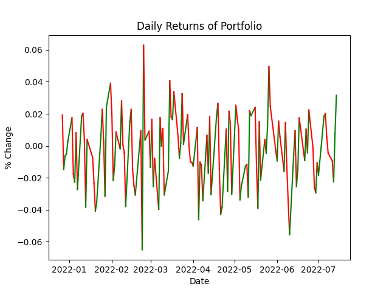

# Historical Portfolio Comparison Tool 

With new investment tools becoming available such as creating your own "index" or "fund" (Fidelity FidFolio is an example), you may want to see the historical performance of your intended composition before investing. This tool allows you to do just that. First you put all your tickers into a list, then you make another list of their desired weights. Pick a start date and initial cash investment and run. 

There are two things that you need to know. First, if you want visual output make sure you set ```plot=True```. Second, if a stock was not listed at the time of the startdate that was chosen, the program will skip ahead to the earliest date that all stocks were available and start there. In an updated version, it will allow you to start anywhere and then buy companies when they do become available. 


Steps to run:
1. Install via pip: ```pip install git+https://github.com/egolfbr/stock_portfolio_comparison.git```
2. Look at Example 

Image from Example script:


