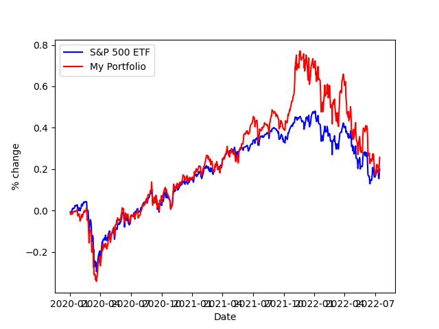

# Historical Portfolio Comparison Tool 

With new investment tools becoming available such as creating your own "index" or "fund" (Fidelity FidFolio is an example), you may want to see the historical performance of your intended composition before investing. This tool allows you to do just that. First you put all your tickers into a list, then you make another list of their desired weights. Pick a start date and initial cash investment and run. 

There are two things that you need to know. First, if you want visual output make sure you set ```plot=True```. Second, if a stock was not listed at the time of the startdate that was chosen, the program will skip ahead to the earliest date that all stocks were available and start there. In an updated version, it will allow you to start anywhere and then buy companies when they do become available. 


Steps to run:
1. Install via pip: ```pip install git+https://github.com/egolfbr/stock_portfolio_comparison.git```
2. Look at Example 

Image from Example script:




This will be updated with more functinoality and eventually rolled into a package instead of a module. As of 7/30/22 this module has the functionality to show you historical performance of a weighted portfolio against the S&P 500, model future dividend performance of a single stock and a weighted portfolio, and show how exposed to a single sector or industry a weighted portfolio is via a ring/pie chart. Future updates will allow for more intuitive dividend modeling, and more performance metrics and modeling options. Feel free to contribute or message suggesttions.

### Donate
If you feel that this has helped you in any way, please consider donating. This is completly free to use and this is in no way a requirement. 

Send BTC to: 3Ef5RzoTv5fih2S8NsQUUFucueVBW4Gohg

Send ETH to: 


